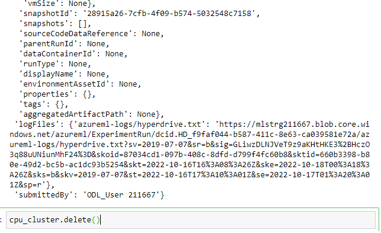

# Optimizing an ML Pipeline in Azure

## Overview
This project is part of the Udacity Azure ML Nanodegree.
In this project, we build and optimize an Azure ML pipeline using the Python SDK and a provided Scikit-learn model.
This model is then compared to an Azure AutoML run.

## Useful Resources
- [ScriptRunConfig Class](https://docs.microsoft.com/en-us/python/api/azureml-core/azureml.core.scriptrunconfig?view=azure-ml-py)
- [Configure and submit training runs](https://docs.microsoft.com/en-us/azure/machine-learning/how-to-set-up-training-targets)
- [HyperDriveConfig Class](https://docs.microsoft.com/en-us/python/api/azureml-train-core/azureml.train.hyperdrive.hyperdriveconfig?view=azure-ml-py)
- [How to tune hyperparamters](https://docs.microsoft.com/en-us/azure/machine-learning/how-to-tune-hyperparameters)

## Summary
The dataset used in this project contains data collected during direct marketing campaigns (phone calls) of a Portuguese banking institution. This is a subset of the original public dataset available at UCI Machine Learning repository. In this website a detailed description of each feature can be found.

It consists of 32950 entries, 20 features containing information about client, information relative to the marketing campaign, and social and economic metrics.

This is a classification problem wich goal is to predict if the client will subscribe (yes/no) to a bank term deposit (variable y).

Solution and Result:

For this classification problem to approaches were used:
Apply a Scikit-Learn Logistic Regression model while using HyperDrive to optimize its hyperparameters. On the same dataset, create and optimize a model using Azure Auto ML. As a consequence, the model created using AutoML was the best one where accuracy was the main metric. A Voting Ensemble model was used. But the accuracy attained using Logistic Regression with HyperDrive and AutoML were nearly same, at 0.9109 and 0.9174, respectively. We further determine which attributes have more weight on the predictions since explainability is the major benefit of the AutoML. Additionally, we can see the importance of other metrics, which in the case of a dataset like this one that is unbalanced, might say more than accuracy.

The bandit termination strategy stops the iteration early anytime the primary measure is outside the slack factor barrier, which helps us prevent needless runs. This will further guarantee that every run will produce a measure that is better than the one before.

## Scikit-learn Pipeline
**Explain the pipeline architecture, including data, hyperparameter tuning, and classification algorithm.**

A search through several sets of hyperparameters was conducted using RandomParameterSampling. It will assist us in selecting parameter values at random from among the range of possible values. This kind of parameter sampling is best used when we wish to maximize model performance while minimizing the usage of precious computer resources.

The bandit termination strategy stops the iteration early anytime the primary measure is outside the slack factor barrier, which helps us prevent needless runs. This will further guarantee that every run will produce a measure that is better than the one before.

## AutoML
**In 1-2 sentences, describe the model and hyperparameters generated by AutoML.**
We first set up the AutoML run by choosing the dataset, column to predict, accuracy as the measure to optimize, classification as the job to accomplish in this case, along with other parameters like the maximum iterations to complete and experiment timeout minutes. Next, we pass the run settings and submit the experiment method.

The VotingEnsemble Algorithm, whose underlying classifier was LightGBM, in this case produced an accuracy of 91.76% and proved to be the best model. When employing ensemble models instead of just one model, machine learning outcomes and prediction performance are improved. For classification problems, the VotingEnsemble Algorithm makes predictions based on the weighted average of anticipated class probabilities. The ensemble iterations in Azure AutoML show up at the end using all the individual models to build the ensemble.

## Pipeline comparison
**Compare the two models and their performance. What are the differences in accuracy? In architecture? If there was a difference, why do you think there was one?**

Although the accuracy of the two top models utilizing AutoML and Hyperdrive was almost identical, AutoML provided us with the best model for this dataset. The accuracy discrepancy was 0.65%. Compared to the VotingEnsemble, which combines the predictions of several weak learners to boost the models' capability, the Logistic Regression Model is somewhat simpler in nature.

Additionally, Hyperdrive was set up to solely employ Logistic Regression as the preferred model, but AutoML had the benefit of testing out a variety of algorithms and an ensemble of many models in order to create a reliable model. As a result, AutoML had the chance to do further research and create a superior model than Hyperdrive.

For this specific dataset AutoML does not seem to be warranted as the computational vs accuracy improvement is marginal.

## Future work
**What are some areas of improvement for future experiments? Why might these improvements help the model?**

Class Imbalance: The AutoML run details indicated that the dataset was unbalanced. This can be dealt with appropriately by combining multiple sample strategies or employing various data sampling techniques like undersampling and oversampling.

Since the dataset is unbalanced, accuracy may not be the optimal criterion to use when determining the best model. For imbalanced datasets, metrics like recall and F1 Score are better options, and they will guide us in selecting the best model.

## Proof of cluster clean up
**If you did not delete your compute cluster in the code, please complete this section. Otherwise, delete this section.**
**Image of cluster marked for deletion**
